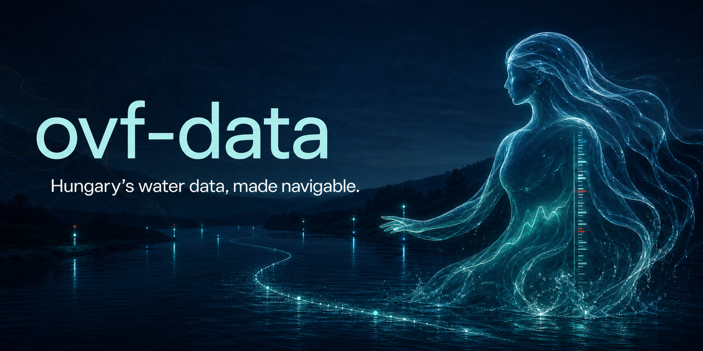
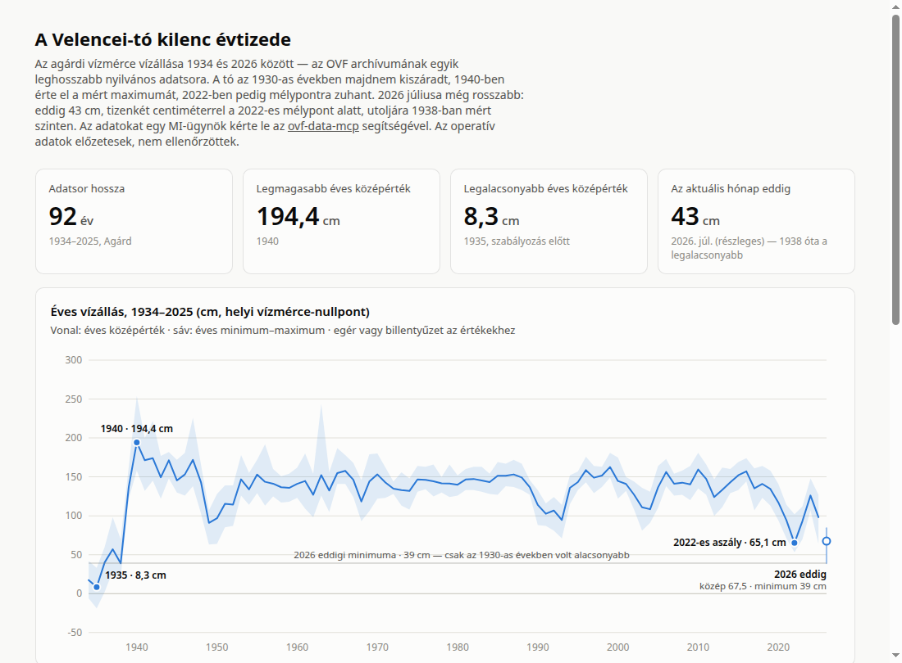

# ovf-data-mcp

[](assets/ovf-data-hero-v2.png)

[](https://pypi.org/project/ovf-data-mcp/)
[](https://www.python.org/downloads/)
[](LICENSE)
[](https://modelcontextprotocol.io/)
[](TODO.md)

Agent-friendly, read-only access to public Hungarian water-management data from the
Országos Vízügyi Főigazgatóság (OVF).

> [!IMPORTANT]
> `ovf-data-mcp` is an independent, unofficial project. It is not affiliated with or
> endorsed by OVF. OVF and the regional water directorates remain the authoritative
> sources for the data.

> [!WARNING]
> This repository is an experimental proof of concept, not a finished or supported
> production service. Interfaces and upstream integrations may change. See
> [`TODO.md`](TODO.md) for known limitations.

`vizugy` supports the investigation workflow agents actually need:

```text
discover → resolve stations → inspect coverage → explain query → retrieve or aggregate → cite
```

The same application logic is exposed through a composable CLI and a local MCP server.
The CLI is the primary interface; MCP tools are thin adapters over identical operations.

## What it can do

- Discover and inspect public OVF ArcGIS datasets.
- Search surface-water stations, shallow-groundwater wells (`--network wells`),
  confined/layer-aquifer wells (`--network deep-wells`), and precipitation stations
  (`--network precipitation`) by name, municipality, or watercourse.
- Find the nearest stations to WGS84 coordinates.
- List authoritative measurement codes, units, accepted ranges, and data types.
- Inspect temporal coverage before requesting observations.
- Retrieve compact, bounded operational or historical time series.
- Aggregate observations upstream by day, ten-day period, month, or year.
- Explain resolved identifiers and query semantics without fetching values.
- Return structured provenance and explicit upstream caveats.

It deliberately does not interpret hydrology, detect anomalies, expose arbitrary SQL,
or provide unrestricted bulk access. The agent remains responsible for analysis.

## Showcase

What an agent can build from a handful of `vizugy` queries — 92 years of Lake Velence
water levels, from the near-dry 1930s to July 2026, which sits below the 2022 crisis
floor at a level last seen in 1938:

[](https://kalcifield.github.io/ovf-data-mcp/examples/lake-velence-90-years.html)

**[View the live dashboard →](https://kalcifield.github.io/ovf-data-mcp/examples/lake-velence-90-years.html)**
([source](docs/examples/lake-velence-90-years.html)) — every number on the page came from
these commands, no scraping or manual downloads:

```bash
vizugy stations search Velence
vizugy observations coverage surface:818          # available from 1934-01-01
vizugy observations aggregate surface:818 \
    --start 1934-01-01T00:00:00Z --end 1960-01-01T00:00:00Z \
    --interval yearly --operation avg   # × avg/min/max × 4 windows, + monthly close-up
```

More examples, each built the same way:

- **[A year of the Danube, measured in Balatons](https://kalcifield.github.io/ovf-data-mcp/examples/danube-in-balatons.html)**
  ([source](docs/examples/danube-in-balatons.html)) — 47 km³ of water passed Budapest
  this year, about one Lake Balaton every 15 days, integrated from daily discharge.
- **[The sinking water table of the Homokhátság](https://kalcifield.github.io/ovf-data-mcp/examples/homokhatsag-groundwater.html)**
  ([source](docs/examples/homokhatsag-groundwater.html)) — three shallow wells on the
  Danube–Tisza ridge, up to 92 years each: the water table has sunk 1–3 metres.
- **[Danube at Budapest — water level, last 12 months](https://kalcifield.github.io/ovf-data-mcp/examples/danube-water-level.html)**
  ([source](docs/examples/danube-water-level.html)) — daily mean with min–max range
  and the flood-alert threshold at the Budapest gauge.
- **[A flood wave travelling down the Danube](https://kalcifield.github.io/ovf-data-mcp/examples/danube-flood-wave.html)**
  ([source](docs/examples/danube-flood-wave.html)) — small multiples of five gauges,
  Komárom to Mohács, tracking the February 2026 crest across ~320 river-km in 3 days.
- **[How low are Hungary's rivers right now?](https://kalcifield.github.io/ovf-data-mcp/examples/rivers-drought-scoreboard.html)**
  ([source](docs/examples/rivers-drought-scoreboard.html)) — six gauges across the
  Duna, Tisza, Dráva and Balaton, each placed in its own 12-month range.

All examples with previews: **[kalcifield.github.io/ovf-data-mcp](https://kalcifield.github.io/ovf-data-mcp/)**

## Data sources

| Source | Purpose | Status |
|---|---|---|
| [VRAQuery OpenAPI](https://vmservice.vizugy.hu/vraquery/swagger/index.html) | Stations, measurement catalogues, coverage, observations, aggregation | Officially documented |
| [OVF ArcGIS REST](https://geoportal.vizugy.hu/arcgis/rest/services) | Spatial dataset discovery and layer metadata | Public; metadata quality varies |
| [data.vizugy.hu](https://data.vizugy.hu/) | Official public-data frontend and anonymous access flow | Public frontend |

Operational observations may be preliminary or unchecked. For official proceedings or
guaranteed checked data, follow OVF's formal data-request process.

## Installation

Install [`uv`](https://docs.astral.sh/uv/), then choose the CLI or an MCP client.

### CLI

Install both `vizugy` and `ovf-data-mcp` as isolated global tools:

```bash
uv tool install ovf-data-mcp
vizugy --help
```

Run the CLI without installing it:

```bash
uvx --from ovf-data-mcp vizugy --help
```

### MCP clients

Claude Code:

```bash
claude mcp add --scope user ovf-data -- uvx ovf-data-mcp
```

Codex CLI and IDE extension:

```bash
codex mcp add ovf-data -- uvx ovf-data-mcp
```

One-click editor installation:

| Client | Install |
|---|---|
| VS Code | [](https://vscode.dev/redirect/mcp/install?name=ovf-data&config=%7B%22type%22%3A%22stdio%22%2C%22command%22%3A%22uvx%22%2C%22args%22%3A%5B%22ovf-data-mcp%22%5D%7D) |
| Cursor | [](https://cursor.com/en/install-mcp?name=ovf-data&config=eyJjb21tYW5kIjoidXZ4IiwiYXJncyI6WyJvdmYtZGF0YS1tY3AiXX0=) |

Generic stdio configuration for Cursor and other MCP clients:

```json
{
  "mcpServers": {
    "ovf-data": {
      "command": "uvx",
      "args": ["ovf-data-mcp"]
    }
  }
}
```

<details>
<summary>Manual VS Code configuration</summary>

Add this to your user configuration or `.vscode/mcp.json`:

```json
{
  "servers": {
    "ovf-data": {
      "type": "stdio",
      "command": "uvx",
      "args": ["ovf-data-mcp"]
    }
  }
}
```

</details>

<details>
<summary>Manual Codex configuration</summary>

Add this to `~/.codex/config.toml`:

```toml
[mcp_servers.ovf-data]
command = "uvx"
args = ["ovf-data-mcp"]
```

</details>

## Quick investigation

### 1. Resolve a station

```bash
vizugy stations search Budapest --watercourse Duna --limit 10
```

Results use stable namespaced IDs such as `surface:1026`.

Find stations by coordinates:

```bash
vizugy stations nearest 47.4979 19.0402 --limit 5
```

### 2. Inspect available measurements and coverage

```bash
vizugy catalog measurements

vizugy observations coverage surface:1026 \
  --metric water-level \
  --data-type operational
```

Useful metric aliases:

- `water-level`
- `discharge`
- `water-temperature`

Useful data-type aliases:

- `raw`
- `observed`
- `checked`
- `processed`
- `hydrological`
- `operational`

Numeric VRA codes and exact catalogue names are also accepted.

### 3. Explain before fetching

```bash
vizugy observations get surface:1026 \
  --metric water-level \
  --data-type operational \
  --start 2026-07-16T00:00:00Z \
  --end 2026-07-17T00:00:00Z \
  --explain
```

The explanation shows the resolved station, metric and data-type codes, UTC bounds,
upstream operation, expected mode, and safety warnings. It performs no value query.

### 4. Retrieve a bounded raw series

```bash
vizugy observations get surface:1026 \
  --metric water-level \
  --data-type operational \
  --start 2026-07-16T00:00:00Z \
  --end 2026-07-17T00:00:00Z \
  --limit 1000 \
  --format jsonl
```

Raw observation queries require explicit bounds and may span at most seven days.
JSONL emits one compact timestamp/value record per line followed by a `_meta` record.

### 5. Aggregate longer periods upstream

```bash
vizugy observations aggregate surface:2046 \
  --metric water-level \
  --data-type operational \
  --start 2026-06-01T00:00:00Z \
  --end 2026-07-01T00:00:00Z \
  --interval daily \
  --operation max
```

Intervals: `daily`, `tenday`, `monthly`, `yearly`.

Operations supported by VRAQuery:
`min`, `max`, `avg`, `sum`, `cnt`, `mean`, `cntday`.

Aggregation buckets follow upstream hydrological/local-day boundaries. Returned bucket
labels remain UTC timestamps and can precede the requested UTC boundary by an offset.

## Dataset discovery

Search the OVF ArcGIS catalogue without knowing folder or layer identifiers:

```bash
vizugy datasets list --query Vizmercek --limit 20 --format json
```

Inspect one service or layer:

```bash
vizugy datasets describe \
  VIR/Vizmercek_vizugyhu_orszagos_adatsoros \
  --layer 6
```

Some advertised ArcGIS folders require authentication. Public discovery skips them and
returns explicit warnings rather than failing the entire catalogue request.

## CLI reference

```text
vizugy datasets list
vizugy datasets describe
vizugy catalog measurements
vizugy stations search
vizugy stations nearest
vizugy observations coverage
vizugy observations get
vizugy observations aggregate
```

Machine-readable output goes to stdout; diagnostics go to stderr.

| Exit code | Meaning |
|---:|---|
| `0` | Success |
| `2` | Invalid or unsafe query |
| `3` | Upstream unavailable or invalid response |
| `4` | Requested entity not found |

## MCP server

MCP clients launch the local stdio server automatically using the configurations above.
To start it directly:

```bash
uvx ovf-data-mcp
```

Available tools:

| Tool | Intent |
|---|---|
| `discover_datasets` | Search public spatial datasets |
| `describe_dataset` | Inspect a service or layer schema |
| `list_measurement_types` | Resolve metrics, units, ranges, and data types |
| `find_stations` | Resolve station names, rivers, and municipalities |
| `nearest_stations` | Resolve coordinates to nearby stations |
| `inspect_coverage` | Check temporal availability before querying |
| `get_observations` | Retrieve a bounded raw series |
| `aggregate_observations` | Aggregate a longer series upstream |

## Output semantics

Observation results distinguish:

- station identity and location;
- observation or aggregation-bucket timestamp;
- metric and unit;
- VRA data type;
- requested UTC interval;
- retrieval timestamp;
- provider and source operation;
- truncation and upstream warnings.

The coverage endpoint currently omits composed operational type `101`. When related
type `100` coverage exists, `vizugy` returns it with an explicit inference warning; it
does not silently claim equivalence.

## Configuration

| Variable | Default | Purpose |
|---|---|---|
| `VIZUGY_ARCGIS_URL` | `https://geoportal.vizugy.hu/arcgis/rest` | ArcGIS catalogue root |
| `VIZUGY_VRA_URL` | `https://vmservice.vizugy.hu/vraquery` | VRAQuery API root |
| `VIZUGY_TOKEN_URL` | `https://data.vizugy.hu/AuthApi/auth/token` | Public frontend token endpoint |
| `VIZUGY_TIMEOUT_SECONDS` | `15` | Upstream request timeout |
| `VIZUGY_CACHE_TTL_SECONDS` | `300` | ArcGIS metadata cache lifetime |

## Development

```bash
git clone https://github.com/kalcifield/ovf-data-mcp.git
cd ovf-data-mcp
uv sync --extra test
uv run ruff format --check src tests
uv run ruff check src tests
uv run ty check src tests
uv run pytest -q
```

Design decisions, verified upstream behavior, and unresolved questions are documented
in [`docs/design.md`](docs/design.md) and [`docs/phase-2-review.md`](docs/phase-2-review.md).

## Licence and data attribution

The software is available under the [MIT License](LICENSE). This does not establish
unrestricted reuse rights for every upstream dataset. Preserve OVF provenance and
verify the applicable data terms before redistribution or production use.
